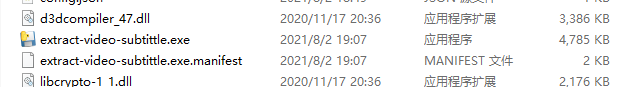

# extract-video-subtittle
使用深度学习框架提取视频硬字幕；

本地识别无需联网；

CPU识别速度可观；

容器提供API接口；


# 运行环境

本项目运行环境非常好搭建，我做好了docker容器免安装各种深度学习包；

提供windows界面操作；

容器为CPU版本；


## 视频演示

https://www.bilibili.com/video/BV18Q4y1f774/


## 程序说明

1、先启动后端容器实例

```shell
docker run -d -p 6666:6666 m986883511/extract_subtitles
```


2、启动程序

简单介绍页面

1：点击左边按钮连接第一步启动的容器；

2：视频提取字幕的总进度

3：当前视频帧显示的位置，就是视频进度条

4：识别出来的文字会在这里显示一下




3、点击选择视频确认字幕位置

点击选择视频按钮，这时你可以拖动进度条到有字幕的位置；然后点击选择字幕区域；在视频中画一个矩形；


4、点击测试连接API


后端没问题的话，会显示已连通；此时所有步骤准备就绪

5、开始识别

点击请先完成前几步按钮，内部分为这几个步骤

1. 本地通过ffmpeg提取视频声音保存到temp目录（0%-10%）
2. api通信将声音文件发送到容器内，容器内spleeter库提取声音中人声，结果保存在容器内temp目录，很耗时间，吃CPU和内存（10%-30）
3. api通信，将人声根据停顿分片，返回分片结果，耗较短的时间（30%-40%）
4. 根据说话分片时间开始识别字幕（40-%100%）

当100%的时候查看temp目录就生成了和视频同名的srt字幕文件


## 运行后台

后端接口容器地址[Docker Hub](https://hub.docker.com/repository/docker/m986883511/extract_subtitles)

此过程可能时间较长，您需要预先安装好好docker，并配置好docker加速器

```shell
docker run -d -p 6666:6666 m986883511/extract_subtitles
```

### 本项目缺少文件
因网速墙的问题，大文件推送不上去，可以参考.gitignore中写的


## 其他
视频提取
```shell
# 视频片段提取
ffmpeg -ss 00:15:45 -t 00:02:15 -i test/three_body_3_7.mp4 -vcodec copy -acodec copy test/3body.mp4
# 打包界面程序
C:/Python/Python38-32/Scripts/pyinstaller.exe main.spec

```

# 参考资料
本项目中深度学习源代码为/docker/backend

原作者为：https://github.com/YaoFANGUK/video-subtitle-extractor
