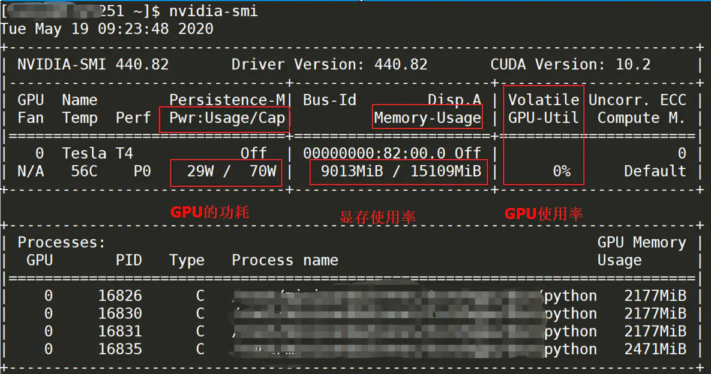

高级使用教程
=============

使用GPU加速
:::::::::::::::::::::::::

硬件环境准备
------------------------
1. 必须是linux系统
#. 安装有英伟达显卡
#. 英伟达显卡驱动的cuda版本必须大于等于10.2

查看显卡驱动
------------------------

>>> nvidia-smi

下图所示的显卡驱动cuda版本为10.2

启动GPU版本的容器
------------------------

>>> docker run -d -p 6666:6666 m986883511/extract_subtitles:gpu

前后端分开部署
:::::::::::::::::::::::::

这样就能在windows上运行界面，linux上跑GPU版本的后端容器

后端操作
------------------------

>>> ifconfig

记录下这台机器的ip地址，请确保这个ip能和前端通

前端操作
------------------------

修改版本目录中中的config.json文件

::

    {
      "ip": "后端ip",
      "port": "6666"
    }

