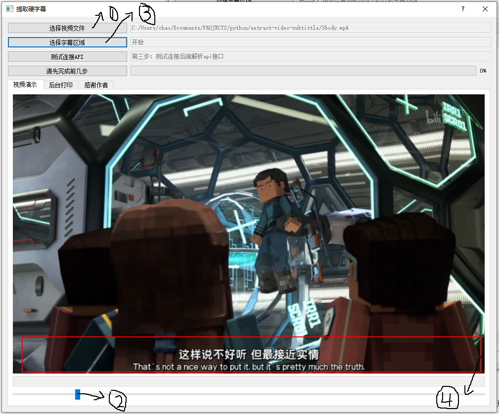

提取视频硬字幕
==================================

.. toctree::
   :maxdepth: 2
   :caption: Contents:

   about
   help
   advance

..
    * :ref:`genindex`
    * :ref:`modindex`
    * :ref:`search`

只需要极为简单的部署就能跑起来
++++++++++++++++++++++++++++++++

下载文件
""""""""""""""""

1. `前端界面release <https://github.com/m986883511/extract-video-subtittle/releases>`_
#. `后端容器 <https://hub.docker.com/repository/docker/m986883511/extract_subtitles>`_

运行容器
""""""""""""""""

在WIN10电脑上，您需要预先安装好好docker，并配置好docker加速器，执行如下命令，就可以跑起深度学习框架后端容器。

::

    docker run -d -p 6666:6666 m986883511/extract_subtitles

运行前端界面
""""""""""""""""

