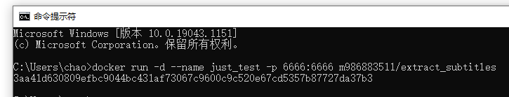
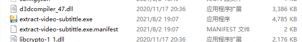
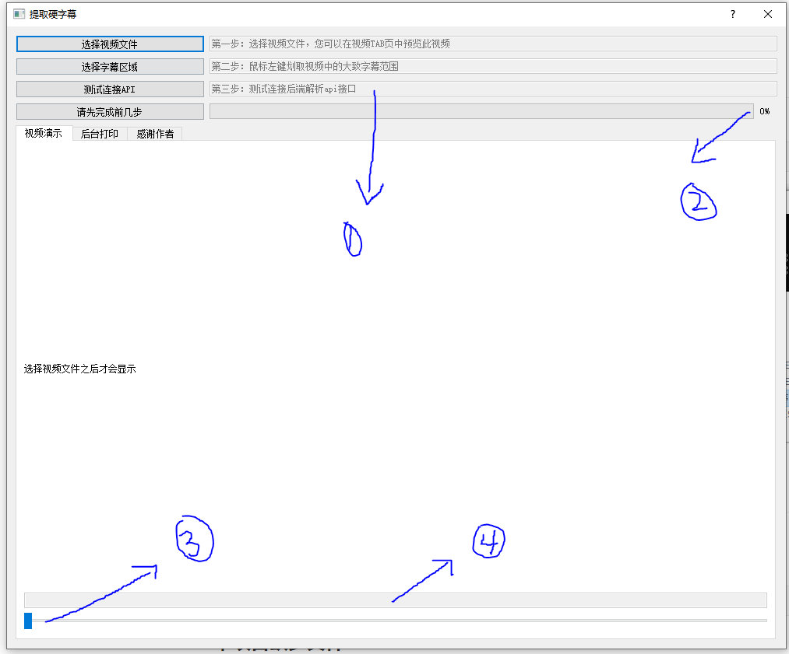
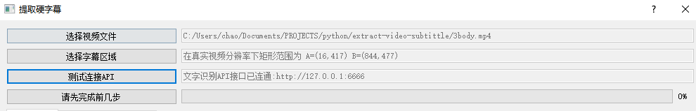

软件使用说明
=============

先启动后端容器实例
:::::::::::::::::::::::::

>>> docker run -d -p 6666:6666 m986883511/extract_subtitles

启动程序
:::::::::::::::::

简单介绍页面
:::::::::::::::::

1. 点击左边按钮连接第一步启动的容器
#. 视频提取字幕的总进度
#. 当前视频帧显示的位置，就是视频进度条
#. 识别出来的文字会在这里显示一下

点击选择视频确认字幕位置
:::::::::::::::::::::::::::

1. 点击选择视频按钮，这时你可以拖动进度条到有字幕的位置
#. 然后点击选择字幕区域；在视频中画一个矩形

.. figure:: _static/image/4-rect.png
   :alt: 选字幕区域
   :align: center

点击测试连接API
:::::::::::::::::::

后端没问题的话，会显示已连通；此时所有步骤准备就绪

开始识别
:::::::::::::::::::

点击 **请先完成前几步** 按钮，当进度条从0走到100，temp目录将生成和视频同名的srt字幕文件。

各个阶段的进度如下：

 - 0%-10%：本机，通过界面程序自带的ffmpeg工具提取视频原声
 - 10%-30%：容器内，利用spleeter提取视频原声中的人声
 - 30%-40%：容器内，利用pydub根据人声的停顿切分音频，返回识别区间
 - 40%-99%：容器内，利用深度学习识别字幕
 - 100%：本机，在temp目生成srt字幕文件
