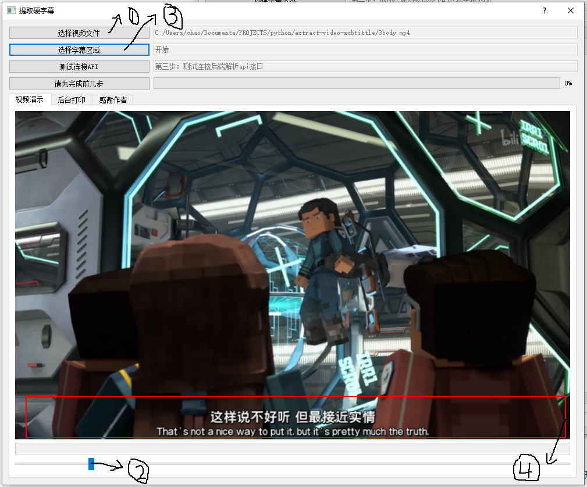

.. sphinx-build source build

提取视频硬字幕
==================================

.. toctree::
   :numbered:
   :maxdepth: 2
   :caption: Contents:

   about
   help
   advance
   code

..
    * :ref:`genindex`
    * :ref:`modindex`
    * :ref:`search`

只需要极为简单的部署就能跑起来
++++++++++++++++++++++++++++++++

下载文件
""""""""""""""""

1. `前端界面release <https://github.com/m986883511/extract-video-subtittle/releases>`_
#. `后端容器 <https://hub.docker.com/repository/docker/m986883511/extract_subtitles>`_

运行容器
""""""""""""""""

在WIN10电脑上，您需要预先安装好好docker，并配置好docker加速器，执行如下命令，就可以跑起深度学习框架后端容器。

::

    docker run -d -p 6666:6666 m986883511/extract_subtitles

运行前端界面
""""""""""""""""

:download:`pdf下载 <../build/latex/sphinx.pdf>`

.. _ok:

abcdefg
""""""""""""

check check check check check check check check check check check check check check check check check :ref:`ok`

.. compound::

    compound you cen check you cen check you cen check you cen check you cen check you cen check you cen check you cen check you cen check :ref:`ok`

.. container::

    container you cen check you cen check you cen check you cen check you cen check you cen check you cen check you cen check you cen check :ref:`ok`

.. rubric::

    rubric you cen check you cen check you cen check you cen check you cen check you cen check you cen check you cen check you cen check :ref:`ok`

.. sidebar::

    sidebar you cen check you cen check you cen check you cen check you cen check you cen check you cen check you cen check you cen check :ref:`ok`

.. topic::

    topic you cen check you cen check you cen check you cen check you cen check you cen check you cen check you cen check you cen check :ref:`ok`

.. epigraph::

    epigraph you cen check you cen check you cen check you cen check you cen check you cen check you cen check you cen check you cen check :ref:`ok`

.. highlights::

    highlights you cen check you cen check you cen check you cen check you cen check you cen check you cen check you cen check you cen check :ref:`ok`

.. pull-quote::

    pull-quote you cen check you cen check you cen check you cen check you cen check you cen check you cen check you cen check you cen check :ref:`ok`

.. class::

    class you cen check you cen check you cen check you cen check you cen check you cen check you cen check you cen check you cen check :ref:`ok`

.. raw::

    raw you cen check you cen check you cen check you cen check you cen check you cen check you cen check you cen check you cen check :ref:`ok`

.. image:: _static/image/1-docker-run.png

.. figure:: _static/image/1-docker-run.png
   :alt: 起容器
   :align: center

.. figure:: _static/image/1-docker-run.png
   :scale: 50 %
   :alt: map to buried treasure

   This is the caption of the figure (a simple paragraph).

   The legend consists of all elements after the caption.  In this
   case, the legend consists of this paragraph and the following
   table:

+----------------------------------------+-----------------------+
| Symbol                                 | Meaning               |
+========================================+=======================+
| .. image:: _static/image/1-docker-run.png   | Campground            |
+----------------------------------------+-----------------------+
| .. image:: _static/image/1-docker-run.png   | Lake                  |
+----------------------------------------+-----------------------+
| .. image:: _static/image/1-docker-run.png   | Mountain              |
+----------------------------------------+-----------------------+

.. list-table:: Frozen Delights!
   :widths: 15 10 30
   :header-rows: 1

   * - Treat
     - Quantity
     - Description
   * - Albatross
     - 2.99
     - On a stick!
   * - Crunchy Frog
     - 1.49
     - If we took the bones out, it wouldn't be
       crunchy, now would it?
   * - Gannet Ripple
     - 1.99
     - On a stick!

.. csv-table:: Frozen Delights!
   :header: "Treat", "Quantity", "Description"
   :widths: 15, 10, 30

   "Albatross", 2.99, "On a stick!"
   "Crunchy Frog", 1.49, "If we took the bones out, it wouldn't be
   crunchy, now would it?"
   "Gannet Ripple", 1.99, "On a stick!"

.. |date| date::
.. |time| date:: %H:%M

Today's date is |date|.

This document was generated on |date| at |time|.